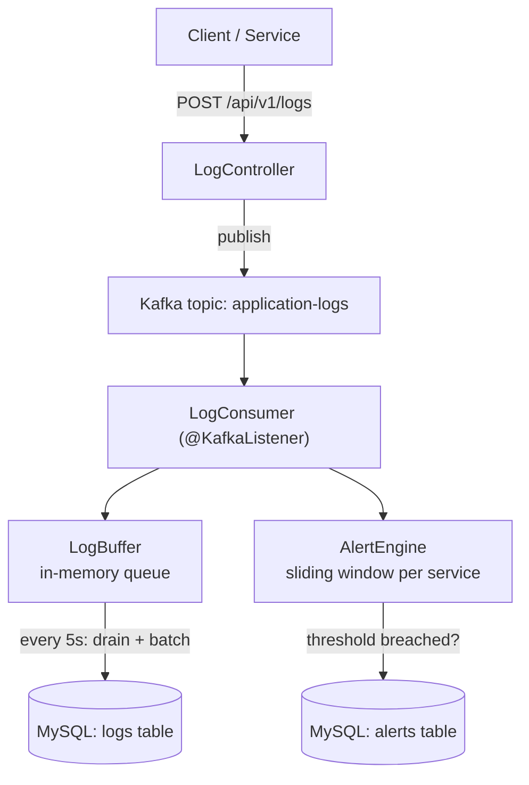

# Log Aggregator

A centralized log ingestion, batching, and alerting service built with **Spring Boot**, **Kafka**, and **MySQL**.

Services push logs over HTTP → they're published to Kafka → a consumer buffers them in memory → a scheduled job flushes batches to MySQL. ERROR-level logs are tracked in a sliding time window per service, and an alert is raised (and persisted) if the error rate crosses a threshold.

## Architecture



- **Ingestion**: `LogController` accepts a log entry over REST and publishes it to Kafka, keyed by `service` so logs from the same service stay ordered within a partition.
- **Buffering & batching**: `LogConsumer` reads off Kafka and pushes entries into an in-memory `LogBuffer`. A `@Scheduled` job drains the buffer every 5 seconds and writes the batch to MySQL via JPA, using Hibernate's batch insert settings for efficiency.
- **Alerting**: Every ERROR-level log is recorded in `AlertEngine`, which tracks per-service error timestamps in a sliding time window (`ArrayDeque` + `ConcurrentHashMap`). If the error count within the window crosses the configured threshold, an `Alert` is persisted to MySQL.

## Tech Stack

- Java 21, Spring Boot 4.1
- Spring Web, Spring Data JPA, Spring Kafka
- MySQL 8.4
- Apache Kafka 3.8 (KRaft mode, no ZooKeeper)
- JUnit 5

## Running Locally

**1. Start Kafka and MySQL:**

Create a `.env` file in the project root:

```
MYSQL_ROOT_PASSWORD=your_root_password
MYSQL_DATABASE=log_aggregator
MYSQL_USER=appuser
MYSQL_PASSWORD=your_app_password
```

Then:

```bash
docker-compose up -d
```

**2. Create the Kafka topic** (auto-creation is disabled on the broker, so this is a required one-time step):

```bash
docker exec -it kafka /opt/kafka/bin/kafka-topics.sh --create \
  --topic application-logs --bootstrap-server localhost:9092 \
  --partitions 3 --replication-factor 1
```

**3. Run the app:**

```bash
./mvnw spring-boot:run
```

The app starts on `http://localhost:8080`.

**4. Send a test log:**

```bash
curl -X POST http://localhost:8080/api/v1/logs \
  -H "Content-Type: application/json" \
  -d '{
    "timestamp": "2026-09-11T10:00:00Z",
    "level": "ERROR",
    "service": "payment-service",
    "message": "Payment gateway timeout"
  }'
```

Send 5 ERROR logs for the same service within 30 seconds and check the `alerts` table — a breach should be recorded.

## Configuration

Alerting thresholds are configurable in `application.properties`:

```properties
alert.window-ms=30000   # sliding window size in ms
alert.threshold=5       # number of errors within the window that triggers an alert
```

## Load Testing

A custom multithreaded Java load generator (`ExecutorService` + `HttpClient`, no external dependencies) was built to simulate concurrent traffic from multiple services and validate the pipeline under real load:

| Concurrent threads | Total requests | Failures | Throughput | Avg latency |
|---|---|---|---|---|
| 20 | 2,000 | 0 | 533 req/s | 33 ms |
| 100 | 20,000 | 0 | 1,496 req/s | 66 ms |
| 500 | 50,000 | 0 | 2,842 req/s | 171 ms |

Every run completed with zero failed requests and zero data loss (verified against MySQL row counts and Kafka consumer offsets after each test).

Under sustained load, consumer lag reached roughly 8,500 unconsumed messages, because the Kafka listener container was running with a concurrency of 1 despite the topic being partitioned into 3. This was fixed by setting the listener's concurrency to match the partition count — since the topic was already correctly partitioned from the start, the fix required a one-line config change with no infrastructure migration.

JDBC batch inserts were confirmed active via Hibernate's own startup log (`HHH100501: Automatic JDBC statement batching enabled`), with bursts of over 1,500 logs flushed to MySQL in a single batch during load testing.

## Known Limitations

- Buffered logs are held in memory and are lost if the app crashes before the next scheduled flush (every 5s). A production version would use Kafka's own offset commits after a successful DB write instead of an in-memory buffer, or a write-ahead log.
- No retry/dead-letter handling if a Kafka send fails from `LogController`.
- No input validation yet on incoming log payloads (planned: Bean Validation on `LogEntryRequest`).

## Project Structure

```
src/main/java/com/khwaish/log_aggregator/
├── controller/   # REST endpoint for log ingestion
├── consumer/     # Kafka consumer, buffering + flush logic
├── buffer/       # In-memory log buffer
├── alert/        # Sliding-window alert detection
├── entity/       # JPA entities (LogEntry, Alert)
├── repository/   # Spring Data JPA repositories
├── dto/          # Request DTOs
└── config/       # Kafka producer/consumer configuration
```